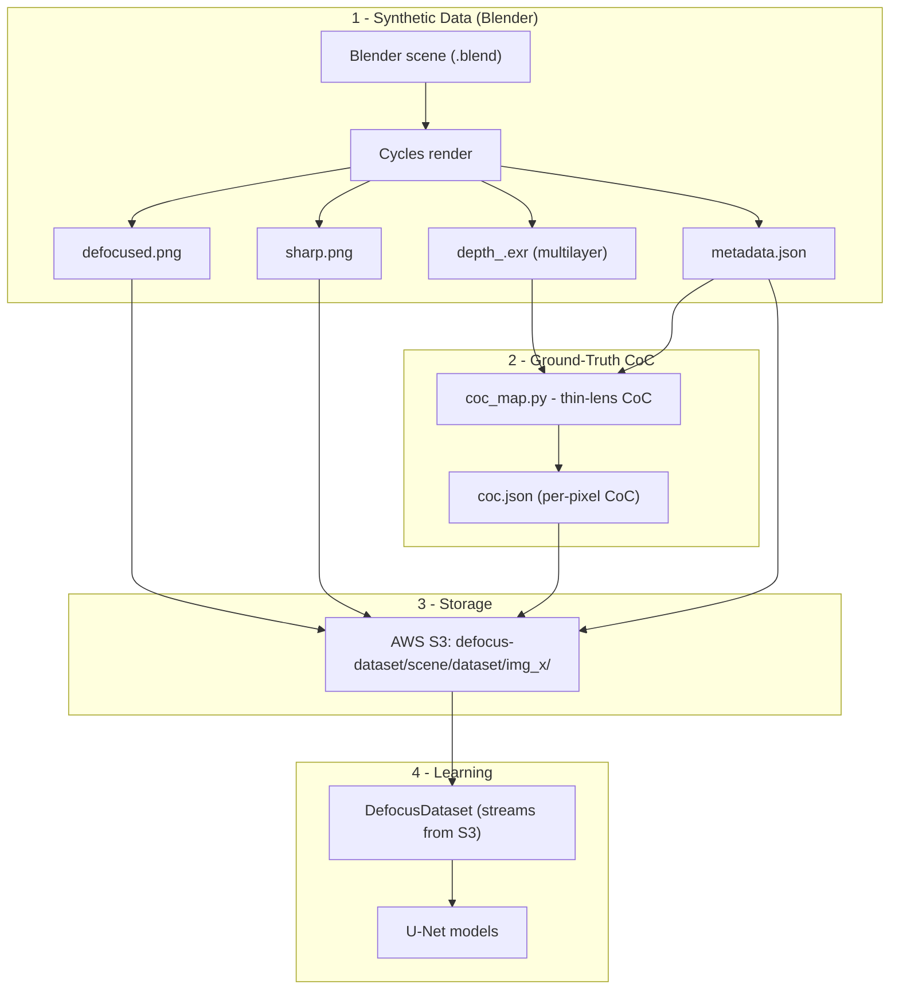

# Image Refocusing

**Post-capture focus control from a single photograph, via physically-grounded blur modeling and a learned image-formation pipeline.**

This project explores image refocusing through a multi-stage machine learning pipeline inspired by computational photography and depth-of-field (DoF) simulation. The long-term goal is to enable **post-capture focus adjustment** from a single defocused photograph by estimating the scene's blur structure and reconstructing images focused at arbitrary depths.

It combines:

- **Synthetic dataset generation** in Blender (Cycles, physically-based rendering)
- **Physically-based Circle of Confusion (CoC)** modeling from depth + camera intrinsics
- **U-Net architectures** for blur estimation and image restoration
- **Computational photography** techniques for depth-of-field rendering
- **Cloud infrastructure** (AWS S3 + GPU instances) for data and training at scale

---

## Problem Statement

Traditional cameras irreversibly bake depth-of-field into an image at capture time. Given a single photograph, we want to answer:

1. **Which regions are in focus?**
2. **How much blur exists at every pixel?**
3. **Can focus be shifted *after* capture?**

This project investigates whether a neural network can estimate a **per-pixel blur map** (Circle of Confusion) and use it to **reconstruct images focused at different depths**.

---

## The Core Idea: Circle of Confusion (CoC)

The blur at every pixel is governed by the optical **Circle of Confusion** — the diameter of the blur disk produced by a point at depth `z` when the lens is focused at distance `d`. Using the thin-lens model with aperture diameter `A = f / N` (focal length `f`, f-number `N`):

$$
\text{CoC}(z) = A \cdot \left| \frac{z - d}{z} \right| \cdot \frac{f}{d - f}
$$

This is computed analytically in `coc_map.py` from the rendered depth pass and the camera metadata, then converted from meters to pixels using the sensor width and image resolution:

$$
\text{CoC}_{px} = \frac{\text{CoC}_{m}}{\text{sensor width}_m} \cdot \text{width}_{px}
$$

The resulting per-pixel CoC map is the **bridge between geometry and appearance**: it is the ground-truth target for the CoC-prediction network and the control signal for the renderer and sharpener networks.

---

## Pipeline Architecture



### Research Direction: a fully learned image-formation pipeline

The project is transitioning toward learning the entire image-formation process end-to-end, decomposed into three learnable stages:

| Stage | Network | Input | Output | Goal |
|-------|---------|-------|--------|------|
| **1** | **Renderer Net** | Sharp image **+** CoC | Defocused image | Learn realistic depth-of-field directly from data |
| **2** | **Sharpener Net** | Defocused image **+** CoC | Sharp image | Recover high-frequency detail lost to blur |
| **3** | **CoC Prediction Net** | Defocused image | Predicted CoC | Replace synthetic ground-truth CoC with a learned estimator |

**Future refocusing system** — chaining the components to move the focal plane after capture:


Potential depth/CoC sources for Stage 3 include **Depth Anything V2**, learned monocular depth estimation, and future CoC-specific networks.

---

## Repository Structure

```
Image_Refocusing/
├── generate_dataset.py        # Orchestrates rendering -> S3 upload -> cleanup across all scenes
├── coc_map.py                 # Reads depth EXR + metadata, computes physical CoC maps
├── generate_coc_data.py       # Batch-generates coc.json ground truth for a scene
├── data_preprocessing.py      # DefocusDataset: streams samples from S3, builds model tensors
├── train.py                   # Training loop (AMP, checkpointing to S3)
├── evaluate.py                # Metrics + visual comparison of predicted vs GT CoC
├── recreate_defocus_default.py# Recreates defocus from a CoC map via disk-blur (analysis tool)
├── requirements.txt
├── models/
│   ├── UNet.py                # U-Net (CoC prediction): 5 in -> 1 out
│   ├── RendererNet.py         # U-Net renderer (Stage 1): RGB + CoC -> defocused RGB
│   └── CNN.py                 # Small reference CNN
└── scenes/                    # One subfolder per Blender scene
    ├── bedroom/  bottle/  cafe/  cars/  grass/
    ├── greenhouse/  house/  kitchen/  nightscene/
    └── <scene>/data_collection_<scene>.py   # Per-scene Blender render script
```

> Large/derived artifacts are git-ignored: `scenes/*/dataset/`, `scenes/*/*.blend`, the local S3 `cache/`, and model weights under `models/unet-params/`.

---

## 1. Synthetic Dataset Generation (Blender)

Each scene under `scenes/<scene>/` ships a `data_collection_<scene>.py` script that runs **inside Blender** and renders a grid of defocused/sharp image pairs with ground-truth depth.

**Per-scene rendering procedure:**

1. Enable the **Z (depth)** and **Object Index** render passes; assign a `pass_index` to every mesh.
2. Sort scene objects by distance to the camera and partition the depth range into bins (from `focus_distances`).
3. For each depth bin, pick a random in-range "subject" object and set focus to its distance.
4. Sweep over **focal lengths** (10 values) × **f-stops** (13 values) and, for each combination, render:
   - `defocused.png` — DoF enabled (the network input / target appearance)
   - `sharp.png` — DoF disabled (all-in-focus reference)
   - `depth_*.exr` — 32-bit multilayer EXR depth pass (channel `depth.V`)
   - `metadata.json` — focus distance, f-stop, focal length, sensor width, resolution, camera pose, object-index map
5. Output is written to `//dataset/` (relative to the `.blend` file → `scenes/<scene>/dataset/`).

**Render settings:** `CYCLES`, `512 × 512`, `64` samples, denoising on, full-frame `35mm` sensor.

### Blender version-safety (4.5 ↔ 5.0)

The compositor API changed substantially in Blender 5.0 (`scene.use_nodes` / `scene.node_tree` were replaced by the node-group based `scene.compositing_node_group`, and the File Output node moved from `file_slots`/`base_path` to `file_output_items`/`directory`/`file_name`). The depth-pass setup (`setup_depth_nodes`) and teardown (`disable_nodes`) **branch on the available API**, so the same scripts run correctly on both **Blender 4.5** (the GPU VM) and **Blender 5.0+** (local dev), and produce the identical `depth.V` channel that `coc_map.py` reads.

### Orchestration: `generate_dataset.py`

Designed to run on a GPU VM where the heavy `.blend` files live in S3 rather than on disk. For each scene it:

1. **Downloads** the scene's `.blend` from `s3://tejas-blender-bucket/defocus-dataset/<scene>/` (auto-detecting the filename).
2. **Renders** by invoking Blender headless: `blender --background <scene>.blend --python data_collection_<scene>.py`.
3. **Uploads** the output to `s3://tejas-blender-bucket/defocus-dataset/<scene>/dataset/` via `aws s3 sync`.
4. **Cleans up** the local `dataset/` folder and downloaded `.blend` to free disk before the next scene.

It auto-discovers scenes from their `data_collection_*.py` scripts, resolves the Blender binary across platforms (env var → `PATH` → macOS app bundle → `/workspace`), and supports an ignore list and per-scene CLI selection.

```bash
python generate_dataset.py                 # all scenes
python generate_dataset.py cafe house      # selected scenes
python generate_dataset.py --no-upload     # local test, skip S3
python generate_dataset.py --keep-local    # keep renders/blend after upload
BLENDER=/path/to/blender python generate_dataset.py   # explicit binary
```

**S3 layout:**

```
s3://tejas-blender-bucket/defocus-dataset/
└── <scene>/
    ├── <scene>.blend
    └── dataset/
        └── img_00000_f1.2_fl50_fd5.61/
            ├── defocused.png
            ├── sharp.png
            ├── depth_*.exr
            ├── metadata.json
            └── coc.json          # added by the CoC step
```

---

## 2. Ground-Truth CoC Computation

- **`coc_map.py`** — `getDepth()` parses the `depth.V` channel from the multilayer EXR; `getMetadata()` merges depth with camera intrinsics; `generate_coc_map()` applies the thin-lens CoC formula to produce a per-pixel CoC map in pixels (with NaN/inf guards and depth validity masking).
- **`generate_coc_data.py`** — iterates over a scene's rendered folders and writes a `coc.json` (CoC ground truth) alongside each sample.

---

## 3. Data Loading: `DefocusDataset`

`data_preprocessing.py` defines a PyTorch `Dataset` that **streams samples directly from S3** (downloading + caching locally on first access). For each sample it builds:

- **Input `x`** — 5 channels at `512 × 512`:
  - RGB of the **defocused** image (3 ch)
  - a constant **f-stop** map (`f_stop / 8`)
  - a constant **focal-length** map (`focal_length_mm / 135`)
- **Target `y`** — the 1-channel **CoC** map, clipped to `[0, 25]px` and normalized to `[0, 1]`.

Encoding the camera parameters as constant feature maps lets the convolutional network condition its blur estimate on the optics that produced the image.

---

## 4. Models (`models/`)

All three networks share a classic **U-Net** backbone: a 5-level contracting/expanding path with `double_convolution` (two `3×3` conv + ReLU) blocks, max-pooling downsampling, transposed-conv upsampling, skip connections, and a final `1×1` conv with a sigmoid output (values in `[0, 1]`).

| Model | Channels | Role |
|-------|----------|------|
| `UNet` | `5 → 1` | **CoC prediction** — defocused RGB + optics → normalized CoC map |
| `RendererNet` | `in → out` (e.g. `4→3`) | **Stage 1 renderer** — sharp RGB + CoC → defocused RGB |
| `CNN` | small | Lightweight reference/baseline model |

Each model file is runnable standalone (`python models/UNet.py`) to print parameter counts and verify output shapes.

---

## 5. Training: `train.py`

- **Loss** — `coc_loss`: a depth-weighted L1 (penalizing larger CoC more, `1 + 4·target`) plus a **gradient loss** term that matches spatial derivatives, encouraging sharp CoC boundaries.
- **Optimization** — `AdamW` with weight decay, `ReduceLROnPlateau` scheduling on validation loss.
- **Mixed precision** — `torch.amp` autocast + `GradScaler` on CUDA.
- **Stability** — explicit NaN/Inf checks on inputs, targets, and loss.
- **Checkpointing** — resumes from a local `latest.pth`; uploads `latest.pth` and `best_*.pth` to `s3://tejas-blender-bucket/defocus-checkpoints/...`.
- **Split** — 85/15 train/validation, deterministic seed.

---

## 6. Evaluation & Analysis

- **`evaluate.py`** — reports average MSE / L1 over a loader and visualizes GT CoC vs. predicted CoC vs. absolute error.
- **`recreate_defocus_default.py`** — reconstructs a defocused image from a CoC map using **binned disk-blur convolution**, then compares against the Blender-rendered defocused image with **PSNR** and **SSIM**. This validates that a CoC map (predicted or analytic) is a faithful, invertible description of the scene's blur.

---

## Technologies

| Area | Tools |
|------|-------|
| **Machine Learning** | PyTorch, U-Net, mixed-precision training (AMP) |
| **Computer Vision** | NumPy, OpenCV, scikit-image |
| **Rendering** | Blender, Cycles, OpenEXR |
| **Cloud / Infra** | AWS S3, GPU instances (RunPod) |

---

## Setup

```bash
# Python environment (PyTorch, boto3, scikit-image, OpenEXR/Imath, etc.)
pip install -r requirements.txt

# AWS credentials (for dataset/checkpoint access)
aws configure

# Blender (for dataset generation) — 4.5 on the VM, 5.0+ supported locally
```

**Typical workflow:**

```bash
# 1. Render + upload the dataset (run on a GPU VM with Blender installed)
python generate_dataset.py

# 2. Generate ground-truth CoC for a scene's renders
python generate_coc_data.py

# 3. Train a model (streams data from S3, checkpoints to S3)
python train.py
```

---

## Project Status & Roadmap

- [x] Multi-scene synthetic dataset generation in Blender (9 scenes)
- [x] Blender 4.5 / 5.0 version-safe render scripts
- [x] Physically-based CoC ground-truth computation
- [x] S3-backed dataset + streaming `DefocusDataset`
- [x] U-Net CoC-prediction model + training loop with S3 checkpointing
- [x] CoC-based defocus reconstruction + PSNR/SSIM analysis
- [ ] **Stage 1** — Renderer Net (sharp + CoC → defocused)
- [ ] **Stage 2** — Sharpener Net (defocused + CoC → sharp)
- [ ] **Stage 3** — Learned CoC estimator (replace analytic CoC)
- [ ] End-to-end **refocusing system** with interactive focal-plane control
