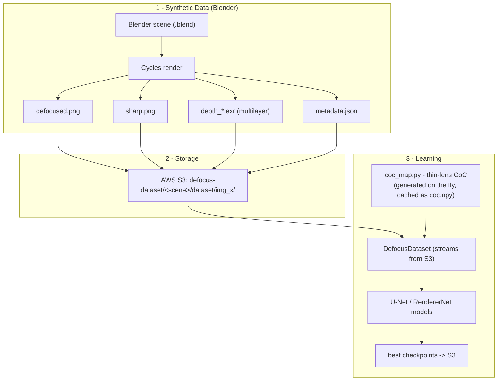
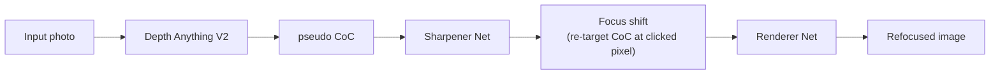
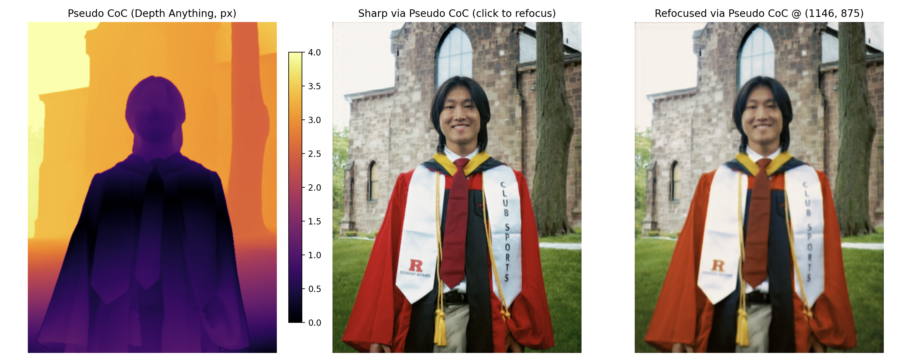

# Image Refocusing

**Post-capture focus control from a single photograph, via physically-grounded blur modeling and a learned image-formation pipeline.**

This project explores image refocusing through a multi-stage machine learning pipeline inspired by computational photography and depth-of-field (DoF) simulation. The long-term goal is to enable **post-capture focus adjustment** from a single defocused photograph by estimating the scene's blur structure and reconstructing images focused at arbitrary depths.

It combines:

- **Synthetic dataset generation** in Blender (Cycles, physically-based rendering)
- **Physically-based Circle of Confusion (CoC)** modeling from depth + camera intrinsics
- **U-Net architectures** for blur synthesis, image restoration, and blur estimation
- **Monocular depth** (Depth Anything V2) to drive refocusing on real, in-the-wild photos
- **Computational photography** techniques for depth-of-field rendering
- **Cloud infrastructure** (AWS S3 + GPU instances) for data and training at scale

---

## Problem Statement

Traditional cameras irreversibly bake depth-of-field into an image at capture time. Given a single photograph, we want to answer:

1. **Which regions are in focus?**
2. **How much blur exists at every pixel?**
3. **Can focus be shifted *after* capture?**

This project investigates whether a neural network can estimate a **per-pixel blur map** (Circle of Confusion) and use it to **reconstruct images focused at different depths**.

---

## The Core Idea: Circle of Confusion (CoC)

The blur at every pixel is governed by the optical **Circle of Confusion** — the diameter of the blur disk produced by a point at depth `z` when the lens is focused at distance `d`. Using the thin-lens model with aperture diameter `A = f / N` (focal length `f`, f-number `N`):

$$
\text{CoC}(z) = A \cdot \left| \frac{z - d}{z} \right| \cdot \frac{f}{d - f}
$$

This is computed analytically in `coc_map.py` from the rendered depth pass and the camera metadata, then converted from meters to pixels using the sensor width and image resolution:

$$
\text{CoC}_{px} = \frac{\text{CoC}_{m}}{\text{sensor width}_m} \cdot \text{width}_{px}
$$

The resulting per-pixel CoC map is the **bridge between geometry and appearance**: it is the ground-truth target for the CoC-prediction network and the control signal for the renderer and sharpener networks.

---

## Pipeline Architecture


```mermaid
flowchart TD
    subgraph DATA["1 - Synthetic Data (Blender)"]
        B["Blender scene (.blend)"] --> R["Cycles render"]
        R --> D1["defocused.png"]
        R --> D2["sharp.png"]
        R --> D3["depth_*.exr (multilayer)"]
        R --> D4["metadata.json"]
    end

    subgraph CLOUD["2 - Storage"]
        D1 & D2 & D3 & D4 --> S3["AWS S3: defocus-dataset/&lt;scene&gt;/dataset/img_x/"]
    end

    subgraph TRAIN["3 - Learning"]
        S3 --> DS["DefocusDataset (streams from S3)"]
        C["coc_map.py - thin-lens CoC<br/>(generated on the fly, cached as coc.npy)"] --> DS
        DS --> M["U-Net / RendererNet models"]
        M --> CK["best checkpoints -> S3"]
    end
```

> **CoC maps are not stored in S3.** They are computed on demand from each sample's depth EXR + metadata by `coc_map.py` inside `DefocusDataset`, then cached locally as `coc.npy` so the depth EXR is only downloaded once.

### A learned image-formation pipeline

The image-formation process is decomposed into three learnable U-Net stages. Each network is conditioned on the camera optics via constant **f-stop** and **focal-length** feature maps, so every RGB-in/RGB-out network takes **6 input channels** (RGB + f-stop + focal + CoC) and the CoC estimator takes **5** (RGB + f-stop + focal):

| Stage | Network | Input | Output | Status |
|-------|---------|-------|--------|--------|
| **1** | **Renderer Net** (`RendererNet`, 6→3) | Sharp RGB **+** optics **+** CoC | Defocused RGB | Implemented — realistic blur synthesis |
| **2** | **Sharpener Net** (`RendererNet`, 6→3) | Defocused RGB **+** optics **+** CoC | Sharp RGB | Implemented — prototype quality |
| **3** | **CoC Net** (`UNet`, 5→1) | Defocused RGB **+** optics | Predicted CoC | Implemented — trained through the frozen renderer |

**Refocusing system** (realized in `prototype.py`) — chaining the components to move the focal plane after capture:


```mermaid
flowchart LR
    IN["Input photo"] --> DA["Depth Anything V2"]
    DA --> PC["pseudo CoC"]
    PC --> SH["Sharpener Net"]
    SH --> FS["Focus shift<br/>(re-target CoC at clicked pixel)"]
    FS --> RN["Renderer Net"]
    RN --> OUT["Refocused image"]
```

The CoC for the in-the-wild prototype comes from **Depth Anything V2** monocular depth (a pseudo-CoC), which currently outperforms the learned CoC Net. The learned `CoC Net` remains the longer-term replacement once it has enough training data.

---

## Demo: Interactive Refocusing

`prototype.py` chains the trained components into a working end-to-end refocusing tool that runs on a **single ordinary photograph** (png/jpg/jpeg) — no rendered depth or metadata required:

1. **Depth → pseudo CoC** — [Depth Anything V2](https://github.com/DepthAnything/Depth-Anything-V2) estimates per-pixel relative depth (`depth_anything_inference.py`), from which a Circle-of-Confusion map is synthesized for any chosen focus point.
2. **Sharpener Net** — recovers an all-in-focus image from the input + CoC.
3. **Click to refocus** — clicking any pixel sets that point as the new focal plane; a fresh CoC map is built from its depth and **Renderer Net** re-renders the photograph with depth-of-field focused there.



In the example above, the input is a portrait with the subject in focus. Clicking on the **building behind the subject** re-targets the focal plane to the far depth: the Renderer Net produces a new defocused image where the building is rendered sharp while the **foreground subject falls out of focus**. The synthesized blur is smooth and depth-consistent — the Renderer Net does a convincing job of estimating what the out-of-focus regions should look like, which is the core capability needed for post-capture focus control.

### Findings so far

- **Renderer Net** — estimates realistic depth-of-field blur very well; out-of-focus appearance is convincing and depth-consistent.
- **Sharpener Net** — already good enough for a prototype, but would benefit from more/cleaner training data to fully recover high-frequency detail.
- **CoC source** — a pseudo-CoC generated analytically from **Depth Anything V2** depth is currently **noticeably more accurate** than the CoC predicted directly by the learned CoC network; the learned estimator likely needs more data to close the gap. The prototype therefore uses the Depth-Anything pseudo-CoC path.

---

## Repository Structure

```
Image_Refocusing/
├── generate_dataset.py        # Orchestrates rendering -> S3 upload -> cleanup across all scenes
├── coc_map.py                 # Reads depth EXR + metadata, computes physical CoC maps
├── data_preprocessing.py      # DefocusDataset: streams from S3, builds tensors, generates CoC on the fly
├── trainRendererNet.py        # Train Renderer Net (sharp + CoC -> defocused), MSE, S3 checkpointing
├── trainSharpenerNet.py       # Train Sharpener Net (defocused + CoC -> sharp), MSE, S3 checkpointing
├── trainCOCNet.py             # Train CoC Net through the frozen Renderer (composite loss)
├── depth_anything_inference.py# Depth Anything V2 -> relative depth -> pseudo-CoC
├── prototype.py               # End-to-end interactive refocusing demo (click-to-refocus)
├── recreate_defocus_default.py# Sharp + CoC -> defocused via RendererNet (weights from S3), with metrics
├── recreate_sharp_default.py  # Defocused + CoC -> sharp via SharpenerNet (weights from S3), with metrics
├── generate_coc_data.py       # (legacy) writes coc.json next to local renders
├── evaluate.py                # (legacy) MSE/L1 + visual comparison for the old CoC-prediction model
├── requirements.txt
├── assets/refocus_example.png # README demo image
├── models/
│   ├── UNet.py                # U-Net (CoC Net): 5 in -> 1 out
│   ├── RendererNet.py         # U-Net renderer/sharpener: 6 in -> 3 out
│   └── CNN.py                 # Small reference CNN
├── external/Depth-Anything-V2/# Vendored Depth Anything V2 (git-ignored)
└── scenes/                    # One subfolder per Blender scene
    ├── bedroom/  bottle/  cafe/  cars/  grass/
    ├── greenhouse/  house/  kitchen/  nightscene/
    └── <scene>/data_collection_<scene>.py   # Per-scene Blender render script
```

> Large/derived artifacts are git-ignored: `scenes/*/dataset/`, `scenes/*/*.blend`, the local S3 `cache/`, `checkpoints/`, and the vendored `external/` (Depth Anything V2 + weights).

---

## 1. Synthetic Dataset Generation (Blender)

Each scene under `scenes/<scene>/` ships a `data_collection_<scene>.py` script that runs **inside Blender** and renders a grid of defocused/sharp image pairs with ground-truth depth.

**Per-scene rendering procedure:**

1. Enable the **Z (depth)** and **Object Index** render passes; assign a `pass_index` to every mesh.
2. Sort scene objects by distance to the camera and partition the depth range into bins (from `focus_distances`).
3. For each depth bin, pick a random in-range "subject" object and set focus to its distance.
4. Sweep over **focal lengths** (10 values) × **f-stops** (13 values) and, for each combination, render:
   - `defocused.png` — DoF enabled (the network input / target appearance)
   - `sharp.png` — DoF disabled (all-in-focus reference)
   - `depth_*.exr` — 32-bit multilayer EXR depth pass (channel `depth.V`)
   - `metadata.json` — focus distance, f-stop, focal length, sensor width, resolution, camera pose, object-index map
5. Output is written to `//dataset/` (relative to the `.blend` file → `scenes/<scene>/dataset/`).

**Render settings:** `CYCLES`, `512 × 512`, `64` samples, denoising on, full-frame `35mm` sensor.

### Blender version-safety (4.5 ↔ 5.0)

The compositor API changed substantially in Blender 5.0 (`scene.use_nodes` / `scene.node_tree` were replaced by the node-group based `scene.compositing_node_group`, and the File Output node moved from `file_slots`/`base_path` to `file_output_items`/`directory`/`file_name`). The depth-pass setup (`setup_depth_nodes`) and teardown (`disable_nodes`) **branch on the available API**, so the same scripts run correctly on both **Blender 4.5** (the GPU VM) and **Blender 5.0+** (local dev), and produce the identical `depth.V` channel that `coc_map.py` reads.

### Orchestration: `generate_dataset.py`

Designed to run on a GPU VM where the heavy `.blend` files live in S3 rather than on disk. For each scene it:

1. **Downloads** the scene's `.blend` from `s3://tejas-blender-bucket/defocus-dataset/<scene>/` (auto-detecting the filename).
2. **Renders** by invoking Blender headless: `blender --background <scene>.blend --python data_collection_<scene>.py`.
3. **Uploads** the output to `s3://tejas-blender-bucket/defocus-dataset/<scene>/dataset/` via `aws s3 sync`.
4. **Cleans up** the local `dataset/` folder and downloaded `.blend` to free disk before the next scene.

It auto-discovers scenes from their `data_collection_*.py` scripts, resolves the Blender binary across platforms (env var → `PATH` → macOS app bundle → `/workspace`), and supports an ignore list and per-scene CLI selection.

```bash
python generate_dataset.py                 # all scenes
python generate_dataset.py cafe house      # selected scenes
python generate_dataset.py --no-upload     # local test, skip S3
python generate_dataset.py --keep-local    # keep renders/blend after upload
BLENDER=/path/to/blender python generate_dataset.py   # explicit binary
```

**S3 layout:**

```
s3://tejas-blender-bucket/defocus-dataset/
└── <scene>/
    ├── <scene>.blend
    └── dataset/
        └── img_00000_f1.2_fl50_fd5.61/
            ├── defocused.png
            ├── sharp.png
            ├── depth_*.exr
            └── metadata.json
```

> CoC maps are computed on demand from `depth_*.exr` + `metadata.json` at load time (not stored in S3).

---

## 2. CoC Computation (`coc_map.py`)

- `getDepth()` parses the `depth.V` channel from the multilayer EXR (globbing `depth_*.exr` to handle Blender's frame-numbered filenames).
- `getMetadata()` merges depth with camera intrinsics (f-stop, focal length, sensor width, focus distance, aperture diameter `A`).
- `generate_coc_map()` applies the thin-lens CoC formula to produce a per-pixel CoC map in pixels (with NaN/inf guards and depth validity masking).

CoC is generated **on the fly** inside `DefocusDataset` (and cached as `coc.npy` per sample). `generate_coc_data.py` is a legacy helper that wrote `coc.json` next to local renders and is no longer part of the training path.

---

## 3. Data Loading: `DefocusDataset`

`data_preprocessing.py` defines a PyTorch `Dataset` that **streams samples directly from S3** (paginating `defocus-dataset/<scene>/dataset/`, downloading + caching locally on first access). It supports two directions via a `direction` argument:

- `direction="render"` — input RGB is the **sharp** image, target is the **defocused** image.
- `direction="sharpen"` — input RGB is the **defocused** image, target is the **sharp** image.

For each sample it builds:

- **Input `x`** — 6 channels at `512 × 512`:
  - RGB of the input image (3 ch)
  - a constant **f-stop** map (`f_stop / 22`)
  - a constant **focal-length** map (`focal_length_mm / 200`)
  - the **CoC** map (1 ch), generated on the fly from the depth EXR + metadata, clipped to `[0, 25]px` and normalized to `[0, 1]`
- **Target `y`** — the 3-channel target RGB image, in `[0, 1]`.

Encoding the camera parameters as constant feature maps lets the convolutional network condition its output on the optics that produced the image. The `CoC Net` (`trainCOCNet.py`) reuses the same `render` samples but feeds the network only the first 5 channels (RGB + optics) and supervises against the CoC channel.

---

## 4. Models (`models/`)

Both networks share a classic **U-Net** backbone: a 5-level contracting/expanding path with `double_convolution` (two `3×3` conv + ReLU) blocks, max-pooling downsampling, transposed-conv upsampling, skip connections, and a final `1×1` conv with a sigmoid output (values in `[0, 1]`).

| Model | Channels | Role |
|-------|----------|------|
| `UNet` | `5 → 1` | **CoC Net** — defocused RGB + optics → normalized CoC map |
| `RendererNet` | `6 → 3` | **Renderer / Sharpener** — RGB + optics + CoC → RGB (defocused or sharp) |
| `CNN` | small | Lightweight reference/baseline model |

The Renderer and Sharpener use the **same `RendererNet` architecture** (6→3); they differ only in their training data direction and which weights are loaded. Each model file is runnable standalone (`python models/RendererNet.py`) to print parameter counts and verify output shapes.

---

## 5. Training

Three training scripts share the same infrastructure (`AdamW` + weight decay, `ReduceLROnPlateau`, AMP, NaN/Inf guards, deterministic 85/15 split):

| Script | Model | Data direction | Loss |
|--------|-------|----------------|------|
| `trainRendererNet.py` | `RendererNet` 6→3 | `render` (sharp → defocused) | MSE |
| `trainSharpenerNet.py` | `RendererNet` 6→3 | `sharpen` (defocused → sharp) | MSE |
| `trainCOCNet.py` | `UNet` 5→1 | `render` (uses RGB + optics, CoC target) | `image_loss + 0.2·coc_loss` |

- **`trainCOCNet.py`** trains the CoC Net **through a frozen, pretrained Renderer Net**: the predicted CoC is fed to the renderer, and the loss combines the rendered-image MSE with the CoC-map MSE. Because two deep U-Nets are stacked, it uses **bfloat16** autocast (falling back to fp16 + `GradScaler`) and **gradient clipping** for numerical stability.
- **Checkpointing** — checkpoints are written **only to S3, only on a new best** (no local files). Each best checkpoint stores model + optimizer + scheduler + epoch, so training resumes by pulling it back from S3:
  - `s3://tejas-blender-bucket/defocus-checkpoints/renderer-net/best_renderer.pth`
  - `.../sharpener-net/best_sharpener.pth`
  - `.../coc-net/best_coc.pth`

---

## 6. Inference, Evaluation & Analysis

- **`prototype.py`** — the end-to-end interactive refocusing demo (see [Demo](#demo-interactive-refocusing)).
- **`recreate_defocus_default.py`** — runs `RendererNet` (weights from S3) on `sharp + optics + CoC` to reconstruct the defocused image, displaying sharp / NN-defocused / ground-truth defocused plus a CoC heatmap, and reporting **MSE / PSNR / SSIM**.
- **`recreate_sharp_default.py`** — the inverse: runs `SharpenerNet` on `defocused + optics + CoC` to recover the sharp image, with the same metrics.
- **`evaluate.py`** — a legacy MSE/L1 + visualization tool for the original CoC-prediction model.

---

## Technologies

| Area | Tools |
|------|-------|
| **Machine Learning** | PyTorch, U-Net, mixed-precision training (AMP, bf16) |
| **Computer Vision** | NumPy, OpenCV, scikit-image, Depth Anything V2 |
| **Rendering** | Blender, Cycles, OpenEXR |
| **Cloud / Infra** | AWS S3, GPU instances (RunPod) |

---

## Setup

```bash
# Python environment (PyTorch, boto3, scikit-image, OpenEXR/Imath, etc.)
pip install -r requirements.txt

# AWS credentials (for dataset/checkpoint access)
aws configure

# Blender (for dataset generation) — 4.5 on the VM, 5.0+ supported locally
```

**Typical workflow:**

```bash
# 1. Render + upload the dataset (run on a GPU VM with Blender installed)
python generate_dataset.py

# 2. Train the networks (stream data from S3, CoC generated on the fly, checkpoints to S3)
python trainRendererNet.py     # sharp + CoC -> defocused
python trainSharpenerNet.py    # defocused + CoC -> sharp
python trainCOCNet.py          # defocused -> CoC (through the frozen renderer)

# 3. Interactive refocusing demo on any photo (needs Depth Anything V2 weights)
python prototype.py
```

> Depth Anything V2 is vendored under `external/Depth-Anything-V2/` with weights in `checkpoints/` (e.g. `depth_anything_v2_vitb.pth`); both are git-ignored.

---

## Project Status & Roadmap

- [x] Multi-scene synthetic dataset generation in Blender (9 scenes)
- [x] Blender 4.5 / 5.0 version-safe render scripts
- [x] Physically-based CoC ground-truth computation
- [x] S3-backed dataset + streaming `DefocusDataset`
- [x] U-Net CoC-prediction model + training loop with S3 checkpointing
- [x] CoC-based defocus reconstruction + PSNR/SSIM analysis
- [x] **Stage 1** — Renderer Net (sharp + CoC → defocused) — realistic blur synthesis
- [x] **Stage 2** — Sharpener Net (defocused + CoC → sharp) — prototype quality, more data needed
- [x] **Depth Anything V2** integration for monocular depth → pseudo-CoC
- [x] End-to-end **interactive refocusing prototype** (`prototype.py`, click-to-refocus)
- [ ] **Stage 3** — Learned CoC estimator competitive with Depth-Anything pseudo-CoC (needs more data)
